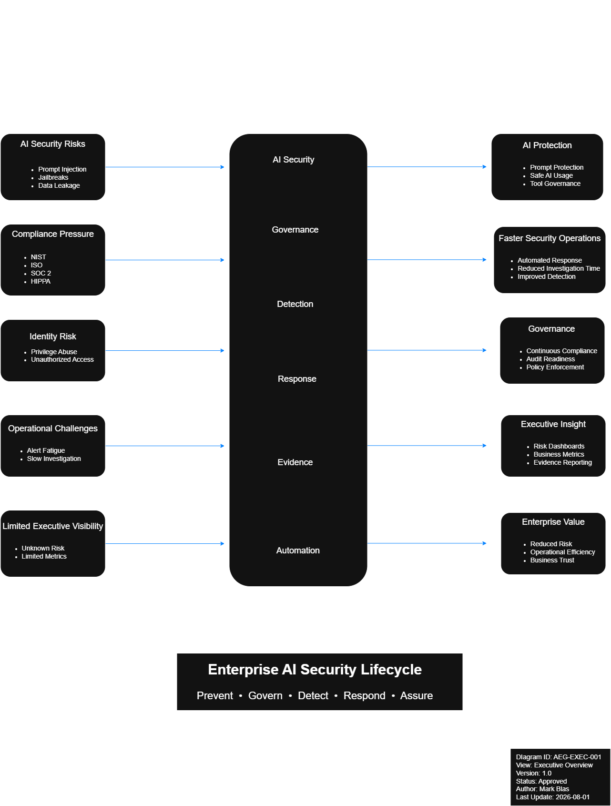
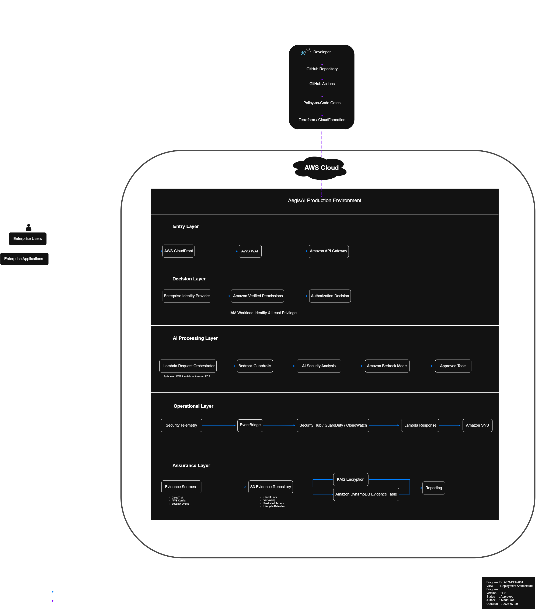

# AegisAI Cloud Security Assurance Platform
<p align="center">


</p>

<p align="center">
  <strong>
    A reference implementation of an enterprise AI security platform demonstrating
    architecture, governance, detection engineering, and automated response on AWS.
  </strong>
</p>

<p align="center">
  
</p>

<p align="center">
  <em>
    Enterprise Architecture Package v1.0 — Eight architectural views documenting
    the design, security, deployment, governance, and operational model of AegisAI.
  </em>
</p>

---

## Table of Contents

- [Overview](#overview)
- [Why AegisAI?](#why-aegisai)
- [Business Value](#business-value)
- [Core Capabilities](#core-capabilities)
- [Architecture](#architecture)
- [Technology Stack](#technology-stack)
- [Architecture Principles](#architecture-principles)
- [Security Framework Alignment](#security-framework-alignment)
- [Repository Structure](#repository-structure)
- [Current Status](#current-status)
- [Project Roadmap](#project-roadmap)
- [Learning Objectives](#learning-objectives)
- [License](#license)

---

## Overview

AegisAI is an enterprise-grade Cloud AI Security platform designed to demonstrate modern Cloud Security Architecture, AI Security Engineering, Detection Engineering, Security Automation, DevSecOps, and Enterprise Governance.

The platform models how organizations can securely deploy, govern, monitor, and continuously assure generative AI systems throughout their lifecycle while aligning with enterprise security frameworks and cloud architecture best practices.

Unlike traditional AI projects that focus primarily on model capabilities, **AegisAI focuses on securing AI.**

---

# Why AegisAI?

Enterprise adoption of Generative AI introduces new security challenges including:

- Prompt Injection
- Jailbreak Attacks
- Sensitive Data Exposure
- Unauthorized Tool Usage
- Identity Abuse
- Model Misuse
- Governance Gaps
- Compliance Requirements

AegisAI demonstrates how enterprise organizations can mitigate these risks through layered security architecture, AI governance, continuous monitoring, and automated response.

---

# Business Value

AegisAI is designed to help organizations:

- Reduce enterprise AI security risk
- Secure AI interactions throughout their lifecycle
- Improve AI governance and policy enforcement
- Accelerate incident detection and response
- Preserve audit-ready evidence
- Support regulatory compliance
- Increase executive visibility into AI risk
- Enable continuous security assurance

---

# Core Capabilities

- AI Security
- Identity & Access Management
- Policy Decision Engine
- AI Security Engine
- Detection Engineering
- Security Orchestration
- Evidence Repository
- Executive Reporting
- Security Automation
- Enterprise Governance

---

# Architecture

AegisAI was designed as an enterprise architecture engagement before implementation began. Each architectural view answers a separate business, security, operational, or technical question.

## Featured Deployment Architecture

<p align="center">
  
</p>

## Architecture Views

| Diagram | Purpose | View |
|---|---|---|
| **Executive Overview** | Connects enterprise AI risks to platform capabilities and business outcomes. | [Open diagram](docs/architecture/svg/AegisAI-Architecture-v1.0-AEG-EXEC-001.svg) |
| **System Context** | Shows human actors, external systems, and the AegisAI platform boundary. | [Open diagram](docs/architecture/svg/AegisAI-Architecture-v1.0-AEG-CTX-001.svg) |
| **Logical Architecture** | Decomposes AegisAI into its primary capability domains and layers. | [Open diagram](docs/architecture/svg/AegisAI-Architecture-v1.0-AEG-LA-001.svg) |
| **Trust Boundary** | Identifies where trust changes and security decisions must occur. | [Open diagram](docs/architecture/svg/AegisAI-Architecture-v1.0-AEG-TB-001.svg) |
| **Data Flow** | Shows how identity data, AI requests, findings, telemetry, and evidence move through the platform. | [Open diagram](docs/architecture/svg/AegisAI-Architecture-v1.0-AEG-DFD-001.svg) |
| **Threat Model** | Shows threat actors, attack surfaces, primary threats, and mitigating control groups. | [Open diagram](docs/architecture/svg/AegisAI-Architecture-v1.0-AEG-TM-001.svg) |
| **Detection & Response** | Shows how security signals become findings, decisions, response actions, evidence, and improvements. | [Open diagram](docs/architecture/svg/AegisAI-Architecture-v1.0-AEG-DR-001.svg) |
| **Deployment Architecture** | Maps logical capabilities to AWS services, deployment zones, and CI/CD workflows. | [Open diagram](docs/architecture/svg/AegisAI-Architecture-v1.0-AEG-DEP-001.svg) |

## Architecture Package

- [Download the complete Architecture Package v1.0](docs/architecture/pdf/AegisAI-Architecture-v1.0.pdf)
- [View the editable Draw.io source](docs/architecture/drawio/AegisAI-Architecture-v1.0.drawio)
- [Read the architecture documentation](docs/architecture/documentation/)

---

# Technology Stack

## Cloud Platform

- AWS

## AI Services

- Amazon Bedrock

## Identity

- Amazon Cognito
- Amazon Verified Permissions

## Edge Security

- CloudFront
- AWS WAF
- API Gateway

## Compute

- AWS Lambda

## Detection & Monitoring

- CloudTrail
- GuardDuty
- Security Hub
- AWS Config
- CloudWatch
- EventBridge

## Data Protection

- Amazon S3
- AWS KMS
- Amazon Macie

## Automation

- Amazon SNS
- EventBridge

## Infrastructure

- Terraform
- CloudFormation

## Development

- Python
- React
- Docker

---

# Architecture Principles

The platform follows modern enterprise architecture principles including:

- Zero Trust
- Least Privilege
- Defense in Depth
- Secure by Default
- Infrastructure as Code
- Policy as Code
- Continuous Assurance
- Automation First
- Separation of Duties
- Continuous Monitoring

---

# Security Framework Alignment

AegisAI aligns its architecture with recognized industry frameworks including:

## AI Security

- OWASP Top 10 for LLM Applications
- MITRE ATLAS
- NIST AI Risk Management Framework

## Cloud Security

- AWS Well-Architected Framework
- AWS Security Reference Architecture

## Governance & Compliance

- NIST Cybersecurity Framework (CSF)
- NIST SP 800-53
- CIS Critical Security Controls
- ISO/IEC 27001
- ISO/IEC 27017
- ISO/IEC 27701
- SOC 2

---

# Repository Structure

```
docs/
├── adr/
├── architecture/
│   ├── documentation/
│   ├── drawio/
│   ├── svg/
│   ├── png/
│   └── pdf/
├── business/
├── compliance/
├── executive/
├── governance/
├── incident-response/
├── operations/
└── threat-model/

automation/
detections/
evidence/
policies/
redteam/
scripts/
src/
terraform/
tests/
```

---

# Current Status

| Component | Status |
|-----------|--------|
| Enterprise Architecture | ✅ Complete |
| Architecture Diagrams | ✅ Complete |
| Repository Foundation | ✅ Complete |
| Enterprise Documentation | 🚧 In Progress |
| AWS Infrastructure | 🚧 In Progress |
| AI Security Engine | 🚧 Planned |
| Detection Pipeline | 🚧 Planned |
| Security Automation | 🚧 Planned |
| Executive Dashboard | 🚧 Planned |

---

# Project Roadmap

## Phase 1 — Enterprise Architecture ✅

- Executive Overview
- System Context
- Logical Architecture
- Trust Boundary
- Data Flow
- Threat Model
- Detection & Response
- Deployment Architecture

## Phase 2 — Architecture Documentation

- Executive Summary
- Architecture Overview
- Architecture Decision Records (ADRs)
- Threat Model Report
- Risk Register
- Security Controls Matrix
- Operational Runbooks

## Phase 3 — Platform Development

- Identity Platform
- Policy Decision Engine
- AI Security Engine
- Prompt Injection Detection
- Output Validation
- Detection Pipeline
- Response Orchestration
- Evidence Repository

## Phase 4 — Enterprise Operations

- Executive Dashboard
- Compliance Reporting
- AI Governance
- Continuous Assurance
- Security Analytics

---

# Learning Objectives

This project demonstrates practical experience in:

- Cloud Security Architecture
- AI Security Engineering
- Enterprise Security Architecture
- Detection Engineering
- DevSecOps
- Zero Trust Architecture
- Threat Modeling
- Security Automation
- AWS Security Services
- Executive Communication
- Enterprise Governance

---

# License

This project is licensed under the [MIT License](LICENSE).

AegisAI is an educational and portfolio project demonstrating enterprise cloud security architecture, AI security engineering, governance, detection engineering, and secure software design.
